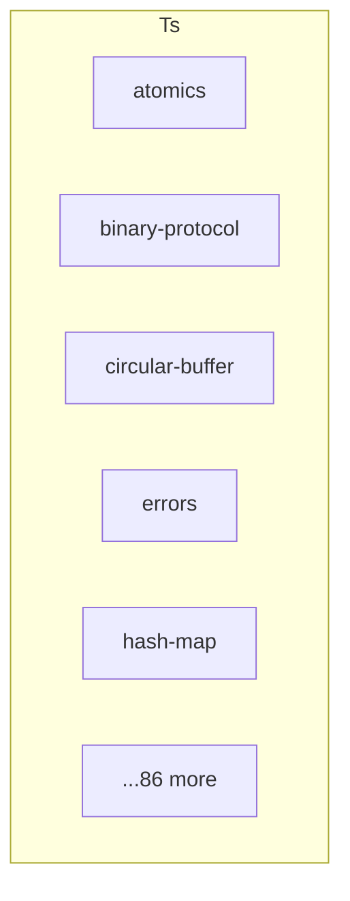

# @danielsimonjr/workerpool - Dependency Graph

**Version**: 10.0.1 | **Last Updated**: 2025-12-24

This document provides a comprehensive dependency graph of all files, components, imports, functions, and variables in the codebase.

---

## Table of Contents

1. [Overview](#overview)
2. [Ts Dependencies](#ts-dependencies)
3. [Dependency Matrix](#dependency-matrix)
4. [Circular Dependency Analysis](#circular-dependency-analysis)
5. [Visual Dependency Graph](#visual-dependency-graph)
6. [Summary Statistics](#summary-statistics)

---

## Overview

The codebase is organized into the following modules:

- **ts**: 91 files

---

## Ts Dependencies

### `src/ts/assembly/atomics.ts` - Atomic Utilities Module

**Exports:**
- Functions: `tryLock`, `acquireLock`, `releaseLock`, `atomicIncrement`, `atomicDecrement`, `atomicIncrement64`, `atomicDecrement64`, `atomicCompareExchange32`, `atomicCompareExchange64`, `atomicLoad32`, `atomicLoad64`, `atomicStore32`, `atomicStore64`, `atomicMax32`, `atomicMin32`, `memoryFence`, `seqlockWriteBegin`, `seqlockWriteEnd`, `seqlockReadBegin`, `seqlockReadValidate`
- Constants: `MAX_CAS_RETRIES`

---

### `src/ts/assembly/binary-protocol.ts` - Binary Protocol for AssemblyScript/WASM

**Exports:**
- Functions: `nextSequence`, `resetSequence`, `writeHeader`, `readHeader`, `validateHeader`, `getPayload`, `encodeTaskRequest`, `decodeTaskRequest`, `encodeTaskResponse`, `encodeErrorResponse`, `encodeHeartbeatRequest`, `encodeHeartbeatResponse`, `decodeHeartbeatResponse`, `encodeBatchHeader`, `getMessageType`, `getMessageId`, `getMessagePriority`, `getMessageSequence`, `hasTransferFlag`, `isCompressed`, `getHeaderSize`, `calculateChecksum`
- Constants: `MAGIC`, `VERSION`, `MSG_TASK_REQUEST`, `MSG_TASK_RESPONSE`, `MSG_TASK_ERROR`, `MSG_EVENT`, `MSG_HEARTBEAT_REQ`, `MSG_HEARTBEAT_RES`, `MSG_CLEANUP_REQ`, `MSG_CLEANUP_RES`, `MSG_TERMINATE`, `MSG_BATCH`, `MSG_STREAM_CHUNK`, `FLAG_HAS_TRANSFER`, `FLAG_COMPRESSED`, `FLAG_ENCRYPTED`, `FLAG_FINAL`, `FLAG_ACK_REQUIRED`, `PRIORITY_LOW`, `PRIORITY_NORMAL`, `PRIORITY_HIGH`, `PRIORITY_CRITICAL`, `ERR_WORKER_CRASHED`, `ERR_WORKER_UNRESPONSIVE`, `ERR_METHOD_NOT_FOUND`, `ERR_INVALID_PARAMS`, `ERR_EXECUTION_FAILED`, `ERR_CANCELLED`, `ERR_TIMEOUT`

---

### `src/ts/assembly/circular-buffer.ts` - Circular Buffer Implementation for AssemblyScript

**Internal Dependencies:**
| File | Imports | Type |
|------|---------|------|
| `./memory` | `HEADER_SIZE, getCapacity, getMask, validateMemory` | Import |

**Exports:**
- Functions: `initBuffer`, `getBufferCapacity`, `getBufferSize`, `isEmpty`, `isFull`, `pushGrowable`, `pushWithEviction`, `shift`, `peekHead`, `peekTail`, `at`, `clear`, `drain`, `getStats`, `logicalToPhysical`, `getHead`, `getTail`, `getBufferMask`

---

### `src/ts/assembly/errors.ts` - Error Codes for WASM Module

**Exports:**
- Functions: `packResult`, `unpackErrorCode`, `unpackValue`, `isSuccess`, `successResult`, `errorResult`
- Constants: `SUCCESS`, `ERR_MEMORY_NOT_INITIALIZED`, `ERR_MEMORY_VALIDATION_FAILED`, `ERR_OUT_OF_MEMORY`, `ERR_INVALID_ADDRESS`, `ERR_MEMORY_ALREADY_INITIALIZED`, `ERR_QUEUE_FULL`, `ERR_QUEUE_EMPTY`, `ERR_QUEUE_OP_FAILED`, `ERR_INVALID_CAPACITY`, `ERR_NO_FREE_SLOTS`, `ERR_INVALID_SLOT_INDEX`, `ERR_SLOT_ALREADY_FREE`, `ERR_SLOT_NOT_ALLOCATED`, `ERR_CAS_FAILED`, `ERR_DEADLOCK`, `ERR_MAX_RETRIES`, `INVALID_SLOT`, `INVALID_ENTRY`

---

### `src/ts/assembly/hash-map.ts` - Hash Map Implementation in AssemblyScript

**Exports:**
- Functions: `fnv1a64`, `hashStringKey`, `initHashMap`, `getHashMapCapacity`, `getHashMapSize`, `hashMapPut`, `hashMapGet`, `hashMapContains`, `hashMapRemove`, `hashMapClear`, `getLoadFactor`, `needsResize`, `getHashMapStats`, `initLRUCache`, `lruCachePut`, `lruCacheGet`, `getLRUCacheSize`, `lruCacheClear`

---

### `src/ts/assembly/histogram.ts` - Histogram Module (AssemblyScript)

**Exports:**
- Functions: `initHistogram`, `initHistogramWithBuckets`, `setBucketBoundary`, `getBucketBoundary`, `recordValue`, `getBucketCount`, `getTotalCount`, `getSum`, `getMin`, `getMax`, `getAverage`, `getHistogramBucketCount`, `calculatePercentile`, `getP50`, `getP90`, `getP95`, `getP99`, `resetHistogram`, `isHistogramInitialized`, `recordValuesBatch`
- Constants: `MAX_HISTOGRAM_BUCKETS`

---

### `src/ts/assembly/index.ts` - WorkerPool WASM Module Entry Point

**Internal Dependencies:**
| File | Imports | Type |
|------|---------|------|
| `./memory` | `*` | Re-export |
| `./ring-buffer` | `*` | Re-export |
| `./task-slots` | `*` | Re-export |
| `./priority-queue` | `*` | Re-export |
| `./circular-buffer` | `*` | Re-export |
| `./errors` | `*` | Re-export |
| `./stats` | `*` | Re-export |
| `./atomics` | `*` | Re-export |
| `./histogram` | `*` | Re-export |
| `./simd-batch` | `*` | Re-export |

**Exports:**
- Re-exports: `* from ./memory`, `* from ./ring-buffer`, `* from ./task-slots`, `* from ./priority-queue`, `* from ./circular-buffer`, `* from ./errors`, `* from ./stats`, `* from ./atomics`, `* from ./histogram`, `* from ./simd-batch`

---

### `src/ts/assembly/k-way-merge.ts` - K-Way Merge Implementation in AssemblyScript

**Exports:**
- Functions: `initKWayMerge`, `setArrayInfo`, `buildInitialHeap`, `extractMin`, `kWayMergeToBuffer`, `getMergedCount`, `mergeI32Arrays`, `mergeF32Arrays`, `getTotalSize`, `twoWayMergeI32`

---

### `src/ts/assembly/memory.ts` - WASM Memory Management Utilities

**Exports:**
- Functions: `isPowerOf2`, `nextPowerOf2`, `calculateMemorySize`, `initMemory`, `validateMemory`, `getCapacity`, `getMask`, `getSlotsBase`, `getHead`, `getTail`, `getSlotAddress`
- Constants: `HEADER_SIZE`, `SLOT_SIZE`, `DEFAULT_CAPACITY`, `CACHE_LINE_SIZE`, `HEADER_MAGIC_OFFSET`, `HEADER_VERSION_OFFSET`, `HEADER_HEAD_OFFSET`, `HEADER_TAIL_OFFSET`, `HEADER_CAPACITY_OFFSET`, `HEADER_MASK_OFFSET`, `HEADER_ALLOCATED_OFFSET`, `HEADER_SLOTS_BASE_OFFSET`, `MAGIC_NUMBER`, `VERSION`

---

### `src/ts/assembly/priority-queue.ts` - Priority Queue Implementation in AssemblyScript

**Internal Dependencies:**
| File | Imports | Type |
|------|---------|------|
| `./memory` | `HEADER_SIZE, SLOT_SIZE, getCapacity, getSlotsBase, validateMemory` | Import |

**Exports:**
- Functions: `initPriorityQueue`, `getPriorityQueueSize`, `isPriorityQueueEmpty`, `priorityQueuePush`, `priorityQueuePop`, `priorityQueuePeek`, `priorityQueuePeekPriority`, `priorityQueueClear`, `isPriorityQueueFull`

---

### `src/ts/assembly/ring-buffer.ts` - Lock-Free Ring Buffer Implementation

**Internal Dependencies:**
| File | Imports | Type |
|------|---------|------|
| `./memory` | `HEADER_SIZE, HEADER_HEAD_OFFSET, HEADER_TAIL_OFFSET, getCapacity, getMask, validateMemory` | Import |

**Exports:**
- Functions: `packEntry`, `unpackSlotIndex`, `unpackPriority`, `push`, `pop`, `size`, `isEmpty`, `isFull`, `clear`, `contains`

---

### `src/ts/assembly/simd-batch.ts` - SIMD Batch Processor (AssemblyScript)

**Exports:**
- Functions: `simdMapMultiplyF32`, `simdMapAddF32`, `simdMapSquareF32`, `simdMapSqrtF32`, `simdReduceSumF32`, `simdReduceMinF32`, `simdReduceMaxF32`, `simdDotProductF32`, `simdAddArraysF32`, `simdMultiplyArraysF32`, `simdMapAbsF32`, `simdMapNegateF32`, `simdMapClampF32`, `simdMapMultiplyF64`, `simdReduceSumF64`, `simdMapMultiplyI32`, `simdReduceSumI32`, `allocateAligned`, `freeAligned`, `copyToWasm`, `copyFromWasm`, `simdCountI32`, `simdCountF32`, `simdIndexOfI32`, `simdIndexOfF32`, `simdIncludesI32`, `simdIncludesF32`, `simdCountGreaterThanF32`, `simdCountLessThanF32`, `simdPartitionF32`

---

### `src/ts/assembly/stats.ts` - Statistics and Diagnostics Module

**Internal Dependencies:**
| File | Imports | Type |
|------|---------|------|
| `./memory` | `validateMemory, HEADER_SIZE` | Import |

**Exports:**
- Functions: `initStats`, `recordPush`, `recordPop`, `recordPushFailure`, `recordPopFailure`, `recordCASRetry`, `recordAllocation`, `recordFree`, `updatePeakSize`, `updatePeakAllocated`, `getPushCount`, `getPopCount`, `getPushFailures`, `getPopFailures`, `getCASRetries`, `getAllocationCount`, `getFreeCount`, `getPeakSize`, `getPeakAllocated`, `resetStats`

---

### `src/ts/assembly/stubs/atomics.ts` - Atomics Stubs for TypeScript Testing

**Exports:**
- Functions: `tryLock`, `acquireLock`, `releaseLock`, `atomicIncrement`, `atomicDecrement`, `atomicIncrement64`, `atomicDecrement64`, `atomicCompareExchange32`, `atomicCompareExchange64`, `atomicLoad32`, `atomicLoad64`, `atomicStore32`, `atomicStore64`, `atomicMax32`, `atomicMin32`, `memoryFence`, `seqlockWriteBegin`, `seqlockWriteEnd`, `seqlockReadBegin`, `seqlockReadValidate`, `_resetAtomics`
- Constants: `MAX_CAS_RETRIES`

---

### `src/ts/assembly/stubs/binary-protocol.ts` - Binary Protocol Stubs for TypeScript Testing

**Exports:**
- Functions: `nextSequence`, `resetSequence`, `writeHeader`, `readHeader`, `validateHeader`, `getPayload`, `encodeTaskRequest`, `decodeTaskRequest`, `encodeTaskResponse`, `encodeErrorResponse`, `decodeErrorResponse`, `encodeHeartbeatRequest`, `encodeHeartbeatResponse`, `decodeHeartbeatResponse`, `encodeBatchHeader`, `getMessageType`, `getMessageId`, `getMessagePriority`, `getMessageSequence`, `hasTransferFlag`, `isCompressed`, `getHeaderSize`, `calculateChecksum`
- Constants: `MAGIC`, `VERSION`, `MSG_TASK_REQUEST`, `MSG_TASK_RESPONSE`, `MSG_TASK_ERROR`, `MSG_EVENT`, `MSG_HEARTBEAT_REQ`, `MSG_HEARTBEAT_RES`, `MSG_CLEANUP_REQ`, `MSG_CLEANUP_RES`, `MSG_TERMINATE`, `MSG_BATCH`, `MSG_STREAM_CHUNK`, `FLAG_HAS_TRANSFER`, `FLAG_COMPRESSED`, `FLAG_ENCRYPTED`, `FLAG_FINAL`, `FLAG_ACK_REQUIRED`, `PRIORITY_LOW`, `PRIORITY_NORMAL`, `PRIORITY_HIGH`, `PRIORITY_CRITICAL`, `ERR_WORKER_CRASHED`, `ERR_WORKER_UNRESPONSIVE`, `ERR_METHOD_NOT_FOUND`, `ERR_INVALID_PARAMS`, `ERR_EXECUTION_FAILED`, `ERR_CANCELLED`, `ERR_TIMEOUT`
- Default: `default`

---

### `src/ts/assembly/stubs/circular-buffer.ts` - Circular Buffer Stubs for TypeScript Testing

**Exports:**
- Functions: `initBuffer`, `getBufferCapacity`, `getBufferSize`, `isEmpty`, `isFull`, `pushGrowable`, `pushWithEviction`, `shift`, `peekHead`, `peekTail`, `at`, `clear`, `drain`, `getStats`, `logicalToPhysical`, `getHead`, `getTail`, `getBufferMask`, `_getDataAt`, `_setDataAt`, `_reset`

---

### `src/ts/assembly/stubs/errors.ts` - Error Codes Stubs for TypeScript Testing

**Exports:**
- Functions: `packResult`, `unpackErrorCode`, `unpackValue`, `isSuccess`, `successResult`, `errorResult`
- Constants: `SUCCESS`, `ERR_MEMORY_NOT_INITIALIZED`, `ERR_MEMORY_VALIDATION_FAILED`, `ERR_OUT_OF_MEMORY`, `ERR_INVALID_ADDRESS`, `ERR_MEMORY_ALREADY_INITIALIZED`, `ERR_QUEUE_FULL`, `ERR_QUEUE_EMPTY`, `ERR_QUEUE_OP_FAILED`, `ERR_INVALID_CAPACITY`, `ERR_NO_FREE_SLOTS`, `ERR_INVALID_SLOT_INDEX`, `ERR_SLOT_ALREADY_FREE`, `ERR_SLOT_NOT_ALLOCATED`, `ERR_CAS_FAILED`, `ERR_DEADLOCK`, `ERR_MAX_RETRIES`, `INVALID_SLOT`, `INVALID_ENTRY`

---

### `src/ts/assembly/stubs/hash-map.ts` - Pure TypeScript stub for hash-map.ts

**Exports:**
- Functions: `fnv1a64`, `hashStringKey`, `initHashMap`, `getHashMapCapacity`, `getHashMapSize`, `hashMapPut`, `hashMapGet`, `hashMapContains`, `hashMapRemove`, `hashMapClear`, `getLoadFactor`, `needsResize`, `getHashMapStats`, `initLRUCache`, `lruCachePut`, `lruCacheGet`, `getLRUCacheSize`, `lruCacheClear`
- Default: `default`

---

### `src/ts/assembly/stubs/histogram.ts` - Histogram Stubs for TypeScript Testing

**Exports:**
- Functions: `initHistogram`, `initHistogramWithBuckets`, `setBucketBoundary`, `getBucketBoundary`, `recordValue`, `getBucketCount`, `getTotalCount`, `getSum`, `getMin`, `getMax`, `getAverage`, `getHistogramBucketCount`, `calculatePercentile`, `getP50`, `getP90`, `getP95`, `getP99`, `resetHistogram`, `isHistogramInitialized`, `recordValuesBatch`, `_resetHistogram`
- Constants: `MAX_HISTOGRAM_BUCKETS`

---

### `src/ts/assembly/stubs/index.ts` - WorkerPool WASM Module Stubs Entry Point

**Internal Dependencies:**
| File | Imports | Type |
|------|---------|------|
| `./memory` | `_resetMemory` | Import |
| `./task-slots` | `_resetSlots` | Import |
| `./priority-queue` | `_resetPriorityQueue` | Import |
| `./circular-buffer` | `_reset` | Import |
| `./stats` | `_resetStats` | Import |
| `./atomics` | `_resetAtomics` | Import |
| `./simd-batch` | `_resetSimd` | Import |
| `./histogram` | `_resetHistogram` | Import |
| `./memory` | `*` | Re-export |
| `./ring-buffer` | `*` | Re-export |
| `./task-slots` | `*` | Re-export |
| `./priority-queue` | `*` | Re-export |
| `./circular-buffer` | `*` | Re-export |
| `./errors` | `*` | Re-export |
| `./stats` | `*` | Re-export |
| `./atomics` | `*` | Re-export |
| `./simd-batch` | `*` | Re-export |
| `./histogram` | `*` | Re-export |

**Exports:**
- Functions: `_resetAll`
- Re-exports: `* from ./memory`, `* from ./ring-buffer`, `* from ./task-slots`, `* from ./priority-queue`, `* from ./circular-buffer`, `* from ./errors`, `* from ./stats`, `* from ./atomics`, `* from ./simd-batch`, `* from ./histogram`

---

### `src/ts/assembly/stubs/k-way-merge.ts` - Pure TypeScript stub for k-way-merge.ts

**Exports:**
- Interfaces: `IndexedItem`
- Functions: `initKWayMerge`, `setArrayInfo`, `getTotalSize`, `kWayMergeI32`, `kWayMergeF32`, `getMergedCount`, `twoWayMergeI32`, `twoWayMergeF32`, `kWayMergeIndexed`
- Default: `default`

---

### `src/ts/assembly/stubs/memory.ts` - Memory Management Stubs for TypeScript Testing

**Exports:**
- Functions: `isPowerOf2`, `nextPowerOf2`, `calculateMemorySize`, `initMemory`, `validateMemory`, `getCapacity`, `getMask`, `getSlotsBase`, `getHead`, `getTail`, `getSlotAddress`, `_setHead`, `_setTail`, `_setAllocated`, `_getAllocated`, `_getEntries`, `_setEntry`, `_getEntry`, `_resetMemory`
- Constants: `HEADER_SIZE`, `SLOT_SIZE`, `DEFAULT_CAPACITY`, `CACHE_LINE_SIZE`, `HEADER_MAGIC_OFFSET`, `HEADER_VERSION_OFFSET`, `HEADER_HEAD_OFFSET`, `HEADER_TAIL_OFFSET`, `HEADER_CAPACITY_OFFSET`, `HEADER_MASK_OFFSET`, `HEADER_ALLOCATED_OFFSET`, `HEADER_SLOTS_BASE_OFFSET`, `MAGIC_NUMBER`, `VERSION`

---

### `src/ts/assembly/stubs/priority-queue.ts` - Priority Queue Stubs for TypeScript Testing

**Internal Dependencies:**
| File | Imports | Type |
|------|---------|------|
| `./memory` | `getCapacity, validateMemory` | Import |

**Exports:**
- Functions: `initPriorityQueue`, `getPriorityQueueSize`, `isPriorityQueueEmpty`, `priorityQueuePush`, `priorityQueuePop`, `priorityQueuePeek`, `priorityQueuePeekPriority`, `priorityQueueClear`, `isPriorityQueueFull`, `_resetPriorityQueue`

---

### `src/ts/assembly/stubs/ring-buffer.ts` - Ring Buffer Stubs for TypeScript Testing

**Internal Dependencies:**
| File | Imports | Type |
|------|---------|------|
| `./memory` | `HEADER_SIZE, getCapacity, getMask, validateMemory, getHead, getTail, _setHead, _setTail, _getEntries, _setEntry, _getEntry` | Import |

**Exports:**
- Functions: `packEntry`, `unpackSlotIndex`, `unpackPriority`, `push`, `pop`, `size`, `isEmpty`, `isFull`, `clear`, `contains`

---

### `src/ts/assembly/stubs/simd-batch.ts` - SIMD Batch Processor Stubs for TypeScript Testing

**Exports:**
- Functions: `_resetSimd`, `allocateAligned`, `freeAligned`, `copyToWasm`, `copyFromWasm`, `_setFloat32Array`, `_getFloat32Array`, `_setFloat64Array`, `_getFloat64Array`, `_setInt32Array`, `_getInt32Array`, `simdMapMultiplyF32`, `simdMapAddF32`, `simdMapSquareF32`, `simdMapSqrtF32`, `simdReduceSumF32`, `simdReduceMinF32`, `simdReduceMaxF32`, `simdDotProductF32`, `simdAddArraysF32`, `simdMultiplyArraysF32`, `simdMapAbsF32`, `simdMapNegateF32`, `simdMapClampF32`, `simdMapMultiplyF64`, `simdReduceSumF64`, `simdMapMultiplyI32`, `simdReduceSumI32`, `simdCountI32`, `simdCountF32`, `simdIndexOfI32`, `simdIndexOfF32`, `simdIncludesI32`, `simdIncludesF32`, `simdCountGreaterThanF32`, `simdCountLessThanF32`, `simdPartitionF32`

---

### `src/ts/assembly/stubs/stats.ts` - Statistics Stubs for TypeScript Testing

**Internal Dependencies:**
| File | Imports | Type |
|------|---------|------|
| `./memory` | `validateMemory` | Import |

**Exports:**
- Functions: `initStats`, `recordPush`, `recordPop`, `recordPushFailure`, `recordPopFailure`, `recordCASRetry`, `recordAllocation`, `recordFree`, `updatePeakSize`, `updatePeakAllocated`, `getPushCount`, `getPopCount`, `getPushFailures`, `getPopFailures`, `getCASRetries`, `getAllocationCount`, `getFreeCount`, `getPeakSize`, `getPeakAllocated`, `resetStats`, `_resetStats`

---

### `src/ts/assembly/stubs/task-slots.ts` - Task Slots Stubs for TypeScript Testing

**Internal Dependencies:**
| File | Imports | Type |
|------|---------|------|
| `./memory` | `SLOT_SIZE, getSlotsBase, getCapacity, validateMemory, _getAllocated, _setAllocated` | Import |

**Exports:**
- Functions: `initTaskSlots`, `allocateSlot`, `freeSlot`, `setTaskId`, `getTaskId`, `setPriority`, `getPriority`, `setTimestamp`, `getTimestamp`, `setMethodId`, `getMethodId`, `addRef`, `release`, `getRefCount`, `getAllocatedCount`, `isAllocated`, `_resetSlots`

---

### `src/ts/assembly/task-slots.ts` - Task Slot Allocator

**Internal Dependencies:**
| File | Imports | Type |
|------|---------|------|
| `./memory` | `SLOT_SIZE, HEADER_ALLOCATED_OFFSET, getSlotsBase, getCapacity, validateMemory` | Import |

**Exports:**
- Functions: `initTaskSlots`, `allocateSlot`, `freeSlot`, `setTaskId`, `getTaskId`, `setPriority`, `getPriority`, `setTimestamp`, `getTimestamp`, `setMethodId`, `getMethodId`, `addRef`, `release`, `getRefCount`, `getAllocatedCount`, `isAllocated`

---

### `src/ts/core/AdvancedPool.ts` - AdvancedPool - Enhanced worker pool with intelligent scheduling

**Internal Dependencies:**
| File | Imports | Type |
|------|---------|------|
| `./Pool` | `Pool, EnhancedPoolOptions, PoolEvents, PoolEventListener` | Import |
| `./Promise` | `WorkerpoolPromise` | Import |
| `./worker-choice-strategies` | `WorkerChoiceStrategyManager, WorkerChoiceStrategy, WorkerSelectionOptions, WorkerStats` | Import |
| `./work-stealing` | `WorkStealingScheduler, StealingPolicy, WorkStealingStats, StealableTask, rebalanceTasks` | Import |
| `./task-affinity` | `TaskAffinityRouter, AffinityKey, RoutingDecision, AffinityRouterOptions, AffinityRouterStats, createAffinityKey, objectAffinityKey` | Import |
| `../types/index` | `ExecOptions` | Import (type-only) |

**Exports:**
- Classes: `AdvancedPool`
- Interfaces: `AdvancedPoolOptions`, `AdvancedExecOptions`, `AdvancedPoolStats`
- Functions: `advancedPool`, `cpuIntensivePool`, `ioIntensivePool`, `mixedWorkloadPool`

---

### `src/ts/core/auto-transfer.ts` - Auto-Transfer Utilities

**Internal Dependencies:**
| File | Imports | Type |
|------|---------|------|
| `../platform/transfer-detection` | `isTransferable, detectTransferables, getTransferableType` | Import |

**Exports:**
- Classes: `AutoTransfer`
- Interfaces: `TransferResult`, `AutoTransferOptions`
- Functions: `extractTransferables`, `autoDetectTransfer`, `wrapForTransfer`, `isWorthTransferring`, `getTransferableSize`, `createTransferableChunks`, `copyChunkForTransfer`, `prepareNumericArrayForParallel`, `optimizeForTransfer`
- Constants: `defaultAutoTransfer`
- Default: `AutoTransfer`

---

### `src/ts/core/batch-executor.ts` - Batch Executor

**Internal Dependencies:**
| File | Imports | Type |
|------|---------|------|
| `../types` | `BatchOptions, BatchProgress, BatchResult, BatchTaskResult, BatchTask, BatchPromise, ExecOptions` | Import (type-only) |
| `./Promise` | `WorkerpoolPromise` | Import |

**Exports:**
- Functions: `createBatchExecutor`, `createMapExecutor`, `executeBatchSimple`
- Default: `default`

---

### `src/ts/core/batch-serializer.ts` - Batch Serializer

**Internal Dependencies:**
| File | Imports | Type |
|------|---------|------|
| `../types` | `BatchTask, ExecOptions` | Import (type-only) |

**Exports:**
- Interfaces: `SerializedTask`, `SerializedBatch`, `SerializedTaskResult`, `SerializedBatchResult`, `SerializerConfig`
- Functions: `generateBatchId`, `serializeFunction`, `serializeBatch`, `deserializeBatch`, `serializeTaskResult`, `deserializeTaskResults`, `estimateBatchSize`, `collectTransferables`, `createBatchAggregator`
- Default: `default`

---

### `src/ts/core/binary-serializer.ts` - Binary Serializer

**External Dependencies:**
| Package | Import |
|---------|--------|
| `@danielsimonjr/workerpool` | `serializeBinary, deserializeBinary` |

**Exports:**
- Interfaces: `BinarySerializedData`
- Functions: `serializeBinary`, `deserializeBinary`, `shouldUseBinarySerialization`, `estimateBinarySize`
- Default: `default`

---

### `src/ts/core/circular-buffer.ts` - CircularBuffer - O(1) fixed-size buffer with automatic eviction

**Exports:**
- Classes: `CircularBuffer`, `TimeWindowBuffer`, `GrowableCircularBuffer`
- Interfaces: `TimestampedValue`
- Default: `CircularBuffer`

---

### `src/ts/core/debug-port-allocator.ts` - Debug Port Allocator for workerpool

**Exports:**
- Classes: `DebugPortAllocator`
- Default: `DebugPortAllocator`

---

### `src/ts/core/function-cache.ts` - Function Compilation Cache

**Exports:**
- Classes: `FunctionCache`
- Interfaces: `FunctionCacheOptions`, `FunctionCacheStats`
- Functions: `createFunctionKey`, `serializeFunction`, `getGlobalFunctionCache`, `clearGlobalFunctionCache`, `compileCached`, `createCachedChunkProcessor`
- Constants: `CACHED_CHUNK_REDUCER`, `CACHED_CHUNK_FILTER`, `CACHED_CHUNK_MAPPER`, `CACHED_CHUNK_FOREACH`, `CACHED_CHUNK_FIND`, `CACHED_CHUNK_COUNTER`
- Default: `FunctionCache`

---

### `src/ts/core/heartbeat.ts` - Heartbeat Mechanism

**Internal Dependencies:**
| File | Imports | Type |
|------|---------|------|
| `../types/messages` | `HEARTBEAT_METHOD_ID, HeartbeatRequest, HeartbeatResponse, PROTOCOL_VERSION, MessagePriority` | Import |
| `../types/error-codes` | `WorkerErrorCode` | Import |

**Exports:**
- Classes: `HeartbeatMonitor`
- Interfaces: `HeartbeatConfig`, `HeartbeatStats`
- Functions: `createHeartbeatRequest`, `createHeartbeatResponse`, `handleHeartbeatInWorker`
- Constants: `HeartbeatErrorCodes`
- Default: `HeartbeatMonitor`

---

### `src/ts/core/k-way-merge.ts` - K-Way Merge Algorithm

**Exports:**
- Interfaces: `IndexedItem`
- Functions: `kWayMergeIndexed`, `kWayMerge`, `extractInOrder`, `mergeFilterResults`, `mergePartitionResults`, `mergeGroupByResults`, `mergeUniqueResults`, `twoWayMerge`, `mergeSmall`, `adaptiveMerge`
- Default: `default`

---

### `src/ts/core/main-thread-executor.ts` - Main Thread Executor

**External Dependencies:**
| Package | Import |
|---------|--------|
| `workerpool/modern` | `createPoolWithFallback, pool` |

**Internal Dependencies:**
| File | Imports | Type |
|------|---------|------|
| `./Promise` | `WorkerpoolPromise` | Import |
| `../types/index` | `ExecOptions, PoolStats, WorkerProxy, BatchTask, BatchOptions, BatchResult, BatchPromise, ParallelOptions, ReduceOptions, FindOptions, PredicateOptions, ForEachResult, ParallelPromise, ReducerFn, CombinerFn, PredicateFn, ConsumerFn, KeySelectorFn, FlatMapFn, UniqueOptions, GroupByOptions, FlatMapOptions` | Import (type-only) |
| `./Pool` | `PoolEvents, PoolEventListener, EnhancedPoolStats` | Import (type-only) |
| `./batch-executor` | `createBatchExecutor, TaskExecutor` | Import |
| `./parallel-processing` | `createParallelReduce, createParallelForEach, createParallelFilter, createParallelSome, createParallelEvery, createParallelFind, createParallelFindIndex, createParallelCount, createParallelPartition, createParallelIncludes, createParallelIndexOf, createParallelGroupBy, createParallelFlatMap, createParallelUnique, createParallelReduceRight` | Import |

**Exports:**
- Classes: `MainThreadExecutor`
- Interfaces: `MainThreadExecutorOptions`
- Functions: `hasWorkerSupport`, `createPoolWithFallback`, `mainThreadExecutor`
- Default: `MainThreadExecutor`

---

### `src/ts/core/metrics.ts` - MetricsCollector - Comprehensive metrics collection for workerpool

**Internal Dependencies:**
| File | Imports | Type |
|------|---------|------|
| `../types/internal` | `WorkerInfo, WorkerState` | Import (type-only) |
| `./circular-buffer` | `CircularBuffer, TimeWindowBuffer` | Import |

**Exports:**
- Classes: `MetricsCollector`
- Interfaces: `HistogramBucket`, `LatencyHistogram`, `WorkerUtilization`, `QueueMetrics`, `ErrorMetrics`, `PoolMetrics`, `MetricsCollectorOptions`
- Default: `MetricsCollector`

---

### `src/ts/core/parallel-processing.ts` - Parallel Processing Functions

**Internal Dependencies:**
| File | Imports | Type |
|------|---------|------|
| `../types/parallel` | `ParallelOptions, ReduceOptions, FindOptions, PredicateOptions, ForEachResult, ParallelPromise, ReducerFn, CombinerFn, PredicateFn, ConsumerFn, KeySelectorFn, FlatMapFn, UniqueOptions, GroupByOptions, FlatMapOptions` | Import (type-only) |
| `../types/index` | `BatchTask, BatchResult` | Import (type-only) |
| `./Promise` | `WorkerpoolPromise` | Import |
| `./batch-executor` | `TaskExecutor` | Import (type-only) |
| `./batch-executor` | `createBatchExecutor` | Import |

**Exports:**
- Functions: `createParallelReduce`, `createParallelForEach`, `createParallelFilter`, `createParallelSome`, `createParallelEvery`, `createParallelFind`, `createParallelFindIndex`, `createParallelCount`, `createParallelPartition`, `createParallelIncludes`, `createParallelIndexOf`, `createParallelGroupBy`, `createParallelFlatMap`, `createParallelUnique`, `createParallelReduceRight`
- Default: `default`

---

### `src/ts/core/Pool.ts` - Pool - Worker pool manager with enhanced features

**Internal Dependencies:**
| File | Imports | Type |
|------|---------|------|
| `./Promise` | `WorkerpoolPromise` | Import |
| `./WorkerHandler` | `WorkerHandler, ensureWorkerThreads, TerminateError` | Import |
| `./WorkerHandler` | `WorkerHandlerOptions, WorkerType` | Import (type-only) |
| `../platform/environment` | `cpus` | Import |
| `./TaskQueue` | `FIFOQueue, LIFOQueue, createQueue` | Import |
| `./debug-port-allocator` | `DebugPortAllocator` | Import |
| `../types/index` | `PoolOptions, ExecOptions, PoolStats, Task, Resolver, TaskQueue, QueueStrategy, WorkerProxy, WorkerArg, BatchTask, BatchOptions, BatchResult, BatchPromise, BatchProgress, MapOptions, ParallelOptions, ReduceOptions, FindOptions, PredicateOptions, ForEachResult, ParallelPromise, ReducerFn, CombinerFn, PredicateFn, ConsumerFn` | Import (type-only) |
| `./batch-executor` | `createBatchExecutor, createMapExecutor, TaskExecutor` | Import |
| `./parallel-processing` | `createParallelReduce, createParallelForEach, createParallelFilter, createParallelSome, createParallelEvery, createParallelFind, createParallelFindIndex` | Import |
| `./session-manager` | `SessionManager, SessionManagerPool` | Import |
| `../types/session` | `Session, SessionOptions` | Import (type-only) |

**Exports:**
- Classes: `Pool`
- Interfaces: `PoolEvents`, `CircuitBreakerOptions`, `RetryOptions`, `MemoryOptions`, `HealthCheckOptions`, `EnhancedExecOptions`, `EnhancedPoolOptions`, `EnhancedPoolStats`
- Functions: `getSharedPool`, `terminateSharedPool`, `hasSharedPool`
- Constants: `PoolEnhanced`
- Default: `Pool`

---

### `src/ts/core/Promise.ts` - WorkerpoolPromise - Custom Promise implementation with cancel and timeout support

**Internal Dependencies:**
| File | Imports | Type |
|------|---------|------|
| `../types/index` | `Resolver, WorkerpoolPromise` | Import (type-only) |

**Exports:**
- Classes: `CancellationError`, `TimeoutError`, `WorkerpoolPromise`
- Default: `WorkerpoolPromise`

---

### `src/ts/core/session-manager.ts` - Session Manager

**Internal Dependencies:**
| File | Imports | Type |
|------|---------|------|
| `./Promise` | `WorkerpoolPromise` | Import |
| `./WorkerHandler` | `WorkerHandler` | Import (type-only) |
| `../types/session` | `Session, SessionOptions, SessionStats, SessionExecOptions, SessionState, WorkerSessionAPI` | Import (type-only) |
| `../types/core` | `ExecOptions` | Import (type-only) |

**Exports:**
- Classes: `SessionManager`
- Interfaces: `SessionManagerPool`
- Default: `SessionManager`

---

### `src/ts/core/simd-processor.ts` - SIMD Processor Integration

**Internal Dependencies:**
| File | Imports | Type |
|------|---------|------|
| `../wasm/feature-detection` | `canUseWasm, hasWASMThreads` | Import |

**Exports:**
- Classes: `SIMDProcessor`
- Interfaces: `SIMDProcessorOptions`
- Functions: `isNumericArray`, `isFloat32Array`, `isFloat64Array`, `isInt32Array`, `hasSIMDSupport`, `simdSumF32`, `simdMinF32`, `simdMaxF32`, `simdMultiplyF32`, `simdAddF32`, `simdSquareF32`, `simdSqrtF32`, `simdDotProductF32`, `simdCountF32`, `simdIndexOfF32`, `simdIncludesF32`, `simdCountGreaterThanF32`, `simdCountLessThanF32`, `simdSumI32`, `simdCountI32`, `simdIndexOfI32`, `createNumericReducer`
- Constants: `defaultSIMDProcessor`
- Default: `SIMDProcessor`

---

### `src/ts/core/task-affinity.ts` - Task Affinity and Intelligent Routing

**Exports:**
- Classes: `TaskAffinityRouter`
- Interfaces: `RoutingDecision`, `TaskTypeProfile`, `WorkerProfile`, `AffinityRouterOptions`, `RoutingOptions`, `AffinityRouterStats`
- Functions: `createAffinityKey`, `objectAffinityKey`

---

### `src/ts/core/TaskQueue.ts` - Task Queue Implementations for workerpool

**Internal Dependencies:**
| File | Imports | Type |
|------|---------|------|
| `../types/index` | `Task, TaskQueue, QueueStrategy` | Import (type-only) |
| `./circular-buffer` | `GrowableCircularBuffer` | Import |

**Exports:**
- Classes: `FIFOQueue`, `LIFOQueue`, `PriorityQueue`
- Functions: `createQueue`
- Default: `default`

---

### `src/ts/core/validateOptions.ts` - Option validation utilities for workerpool

**Exports:**
- Functions: `validateOptions`, `validatePoolOptions`, `validateForkOptions`, `validateWorkerThreadOptions`, `validateWorkerOptions`, `validateExecOptions`
- Constants: `workerOptsNames`, `forkOptsNames`, `workerThreadOptsNames`, `poolOptsNames`, `execOptsNames`
- Default: `default`

---

### `src/ts/core/work-stealing.ts` - Work-Stealing Task Distribution

**Internal Dependencies:**
| File | Imports | Type |
|------|---------|------|
| `./circular-buffer` | `GrowableCircularBuffer` | Import |

**Exports:**
- Classes: `WorkStealingDeque`, `WorkStealingScheduler`
- Interfaces: `StealableTask`, `WorkStealingDequeStats`, `WorkStealingSchedulerOptions`, `TaskSubmitOptions`, `WorkStealingStats`
- Functions: `rebalanceTasks`

---

### `src/ts/core/worker-bitmap.ts` - Worker Bitmap

**Exports:**
- Classes: `WorkerBitmap`, `SharedWorkerBitmap`
- Enums: `WorkerState`
- Constants: `MAX_BITMAP_WORKERS`
- Default: `WorkerBitmap`

---

### `src/ts/core/worker-choice-strategies.ts` - Worker Choice Strategies

**Internal Dependencies:**
| File | Imports | Type |
|------|---------|------|
| `./WorkerHandler` | `WorkerHandler` | Import (type-only) |

**Exports:**
- Classes: `RoundRobinStrategy`, `LeastBusyStrategy`, `LeastUsedStrategy`, `FairShareStrategy`, `WeightedRoundRobinStrategy`, `InterleavedWeightedRoundRobinStrategy`, `WorkerChoiceStrategyManager`
- Interfaces: `WorkerStats`, `WorkerSelectionOptions`, `WorkerSelectionResult`
- Functions: `createStrategy`

---

### `src/ts/core/WorkerHandler.ts` - WorkerHandler - Controls a single worker process/thread

**Internal Dependencies:**
| File | Imports | Type |
|------|---------|------|
| `./Promise` | `WorkerpoolPromise, CancellationError, TimeoutError` | Import |
| `../types/index` | `Resolver, ExecOptions` | Import (type-only) |
| `../types/messages` | `TaskRequest, TaskSuccessResponse, TaskErrorResponse, CleanupResponse, WorkerEvent, SerializedError` | Import (type-only) |
| `./validateOptions` | `validateOptions, forkOptsNames, workerThreadOptsNames, workerOptsNames` | Import |
| `../platform/environment` | `platform, isBun, recommendedWorkerType` | Import |
| `./circular-buffer` | `GrowableCircularBuffer` | Import |

**Exports:**
- Classes: `TerminateError`, `WorkerHandler`
- Interfaces: `WorkerHandlerOptions`
- Functions: `ensureWorkerThreads`
- Constants: `TERMINATE_METHOD_ID`, `CLEANUP_METHOD_ID`, `_tryRequireWorkerThreads`, `_setupProcessWorker`, `_setupBrowserWorker`, `_setupWorkerThreadWorker`
- Default: `WorkerHandler`

---

### `src/ts/debug.ts` - Debug/Verbose Mode Logging

**Exports:**
- Interfaces: `DebugConfig`, `PerfEntry`
- Enums: `LogLevel`, `LogCategory`
- Functions: `enableDebug`, `disableDebug`, `getDebugConfig`, `isDebugEnabled`, `isCategoryEnabled`, `perfStart`, `perfEnd`, `getPerfEntries`, `clearPerfEntries`, `getPerfSummary`, `traced`, `logDispatch`, `logQueueOp`, `logWorkerEvent`, `logPoolEvent`
- Constants: `poolLog`, `workerLog`, `taskLog`, `queueLog`, `wasmLog`, `transferLog`, `perfLog`

---

### `src/ts/errors.ts` - Workerpool Error Classes

**Exports:**
- Classes: `CancellationError`, `TimeoutError`, `TerminationError`, `QueueFullError`, `QueueEmptyError`, `WasmNotAvailableError`, `SharedMemoryNotAvailableError`, `WasmInitializationError`, `WasmNotInitializedError`, `WasmMemoryError`, `TypeMismatchError`, `ValidationError`, `WorkerCreationError`, `NoWorkersAvailableError`, `MethodNotFoundError`
- Functions: `getErrorTypeName`, `wrapError`, `assertType`
- Constants: `TypeGuards`

---

### `src/ts/full.ts` - Workerpool Full Build Entry Point

**External Dependencies:**
| Package | Import |
|---------|--------|
| `workerpool/full` | `workerpool` |
| `workerpool/full` | `pool, canUseWasm, WasmBridge` |

**Internal Dependencies:**
| File | Imports | Type |
|------|---------|------|
| `./core/Pool` | `Pool` | Import |
| `./workers/worker` | `add, emit` | Import |
| `./core/Promise` | `WorkerpoolPromise` | Import |
| `./platform/transfer` | `Transfer` | Import |
| `./platform/environment` | `platform, isMainThread, cpus, isNode, getPlatformInfo, hasWorkerThreads, hasSharedArrayBuffer, hasAtomics, isBun, bunVersion, recommendedWorkerType, getWorkerTypeSupport, isWorkerTypeSupported` | Import |
| `./types/internal` | `PlatformInfo, WorkerTypeSupport` | Import (type-only) |
| `./core/circular-buffer` | `CircularBuffer, GrowableCircularBuffer, TimeWindowBuffer` | Import |
| `./core/circular-buffer` | `TimestampedValue` | Import (type-only) |
| `./core/TaskQueue` | `FIFOQueue, LIFOQueue` | Import |
| `./wasm` | `canUseWasm, canUseWasmThreads` | Import |
| `./platform/transfer` | `transferFloat64, transferFloat32, transferInt32, transferUint32, transferInt16, transferUint16, transferInt8, transferUint8, transferUint8Clamped, transferBigInt64, transferBigUint64, transferTypedArray, transferArrayBuffer, transferArrayBuffers, transferObject, transferImageData` | Re-export |
| `./wasm` | `// Feature detection
  canUseWasm, canUseSharedMemory, canUseWasmThreads, getFeatureStatus, clearFeatureCache, detectWASMFeatures, getRecommendedQueueType, warnIfWASMUnavailable, hasWebAssembly, hasSharedArrayBuffer, hasAtomics, hasWASMThreads, isSecureContext, getFeatureReport, // WASM Bridge
  WasmBridge, isSharedMemorySupported, calculateMemoryPages, loadWasm, loadWasmFromBytes, loadWasmSync, // WASM Queue
  WASMTaskQueue, WasmTaskQueue, createWASMQueue, // Embedded WASM
  setEmbeddedWasm, hasEmbeddedWasm, getEmbeddedWasmBytes, loadEmbeddedWasm, loadEmbeddedWasmSync, WasmFeatures, // Worker Template
  initWasmWorker, initWasmWorkerSync, getWasmBridge, getWasmExports, getSharedBuffer, isWasmInitialized, isUsingSharedMemory, wasmMethod, wasmMethodWithInit, createWasmWorker` | Re-export |
| `./errors` | `WorkerpoolError, CancellationError, TimeoutError, TerminationError, QueueFullError, QueueEmptyError, WasmNotAvailableError, SharedMemoryNotAvailableError, WasmInitializationError, WasmNotInitializedError, WasmMemoryError, TypeMismatchError, ValidationError, WorkerCreationError, NoWorkersAvailableError, MethodNotFoundError, getErrorTypeName, wrapError, assertType, TypeGuards` | Re-export |
| `./debug` | `LogLevel, LogCategory, enableDebug, disableDebug, getDebugConfig, isDebugEnabled, isCategoryEnabled, poolLog, workerLog, taskLog, queueLog, wasmLog, transferLog, perfLog, perfStart, perfEnd, getPerfEntries, clearPerfEntries, getPerfSummary, traced, logDispatch, logQueueOp, logWorkerEvent, logPoolEvent` | Re-export |
| `./types/worker-methods` | `defineWorkerMethods, createTypedProxy, typedMethod, asyncMethod, syncMethod, isMethodName, validateWorkerMethods, createMethodValidator` | Re-export |
| `./core/Pool` | `PoolEnhanced, getSharedPool, terminateSharedPool, hasSharedPool` | Re-export |
| `./platform/capabilities` | `capabilities, getCapabilities, getCachedCapabilities, clearCapabilitiesCache, canUseOptimalTransfer, canUseZeroCopy, getCapabilityReport` | Re-export |
| `./platform/worker-url` | `resolveWorkerUrl, createWorkerBlobUrl, revokeWorkerBlobUrl, getCurrentModuleUrl, createWorkerDataUrl, supportsWorkerModules, getWorkerConfig` | Re-export |
| `./core/binary-serializer` | `serializeBinary, deserializeBinary, shouldUseBinarySerialization, estimateBinarySize` | Re-export |
| `./core/metrics` | `MetricsCollector` | Re-export |
| `./workers/adaptive-scaler` | `AdaptiveScaler, ScaleAction` | Re-export |
| `./workers/health-monitor` | `HealthMonitor, HealthStatus` | Re-export |
| `./workers/recycler` | `IdleRecycler, RecycleReason` | Re-export |
| `./workers/affinity` | `WorkerAffinity, AffinityStrategy` | Re-export |
| `./workers/WorkerCache` | `WorkerCache` | Re-export |
| `./platform/message-batcher` | `MessageBatcher, AdaptiveBatcher` | Re-export |
| `./platform/channel-factory` | `ChannelType, canUseSharedMemory, createChannel, MessagePassingChannel` | Re-export |
| `./platform/structured-clone` | `optimizeForTransfer, hasTransferableContent, createOptimizedTransfer, CloneStrategy` | Re-export |
| `./platform/result-stream` | `ResultStreamSender, ResultStreamReceiver, StreamState, SharedMemoryResultStream` | Re-export |
| `./platform/transfer-detection` | `isTransferable, detectTransferables, getTransferableType, validateTransferables, TransferableType` | Re-export |
| `./core/batch-serializer` | `serializeBatch, deserializeBatch, serializeTaskResult, deserializeTaskResults, generateBatchId, serializeFunction, estimateBatchSize, collectTransferables, createBatchAggregator` | Re-export |
| `./wasm/simd-processor` | `getSIMDProcessor, canUseSIMD, simdMapF32, simdReduceF32, simdDotProduct, resetSIMDProcessor` | Re-export |
| `./core/main-thread-executor` | `MainThreadExecutor, hasWorkerSupport, createPoolWithFallback, mainThreadExecutor` | Re-export |
| `./core/session-manager` | `SessionManager` | Re-export |
| `./core/AdvancedPool` | `AdvancedPool, advancedPool, cpuIntensivePool, ioIntensivePool, mixedWorkloadPool` | Re-export |
| `./core/worker-choice-strategies` | `RoundRobinStrategy, LeastBusyStrategy, LeastUsedStrategy, FairShareStrategy, WeightedRoundRobinStrategy, InterleavedWeightedRoundRobinStrategy, WorkerChoiceStrategyManager, createStrategy` | Re-export |
| `./core/work-stealing` | `WorkStealingDeque, WorkStealingScheduler, rebalanceTasks` | Re-export |
| `./core/task-affinity` | `TaskAffinityRouter, createAffinityKey, objectAffinityKey` | Re-export |
| `./core/parallel-processing` | `createParallelReduce, createParallelForEach, createParallelFilter, createParallelSome, createParallelEvery, createParallelFind, createParallelFindIndex` | Re-export |
| `./types/error-codes` | `WorkerErrorCode, ProtocolErrorCode, TaskErrorCode, ResourceErrorCode, CommunicationErrorCode, getErrorMessage, isWorkerError, isProtocolError, isTaskError, isResourceError, isCommunicationError, getErrorCategory, isRetryableError, isFatalError, ErrorMessages` | Re-export |
| `./types/messages` | `PROTOCOL_VERSION, MIN_PROTOCOL_VERSION, MessagePriority, TERMINATE_METHOD_ID, CLEANUP_METHOD_ID, HEARTBEAT_METHOD_ID, isTaskRequest, isCleanupRequest, isTaskSuccessResponse, isTaskErrorResponse, isWorkerEvent, isCleanupResponse, isHeartbeatRequest, isHeartbeatResponse, createMessage, isValidProtocolVersion, getMessagePriority, compareByPriority` | Re-export |
| `./core/heartbeat` | `HeartbeatMonitor, createHeartbeatRequest, createHeartbeatResponse, handleHeartbeatInWorker, HeartbeatErrorCodes` | Re-export |
| `./assembly/stubs/binary-protocol` | `MAGIC, VERSION, MSG_TASK_REQUEST, MSG_TASK_RESPONSE, MSG_TASK_ERROR, MSG_HEARTBEAT_REQ, MSG_HEARTBEAT_RES, MSG_BATCH, FLAG_HAS_TRANSFER, FLAG_COMPRESSED, PRIORITY_LOW, PRIORITY_NORMAL, PRIORITY_HIGH, PRIORITY_CRITICAL, ERR_METHOD_NOT_FOUND, ERR_TIMEOUT, ERR_CANCELLED, resetSequence, nextSequence, writeHeader, readHeader, encodeTaskRequest, decodeTaskRequest, encodeTaskResponse, encodeErrorResponse, decodeErrorResponse, encodeHeartbeatRequest, encodeHeartbeatResponse, decodeHeartbeatResponse, encodeBatchHeader, validateHeader, getPayload, getMessageType, getMessageId, getMessagePriority, getMessageSequence, hasTransferFlag, isCompressed, getHeaderSize, calculateChecksum` | Re-export |

**Exports:**
- Functions: `pool`, `worker`, `workerEmitEvent`, `enhancedPool`, `optimalPool`, `getRuntimeInfo`, `hasWasmSupport`, `hasFullWasmSupport`
- Constants: `Promise`, `VERSION`, `BUILD_TYPE`
- Re-exports: `transferFloat64`, `transferFloat32`, `transferInt32`, `transferUint32`, `transferInt16`, `transferUint16`, `transferInt8`, `transferUint8`, `transferUint8Clamped`, `transferBigInt64`, `transferBigUint64`, `transferTypedArray`, `transferArrayBuffer`, `transferArrayBuffers`, `transferObject`, `transferImageData`, `// Feature detection
  canUseWasm`, `canUseSharedMemory`, `canUseWasmThreads`, `getFeatureStatus`, `clearFeatureCache`, `detectWASMFeatures`, `getRecommendedQueueType`, `warnIfWASMUnavailable`, `hasWebAssembly`, `hasSharedArrayBuffer`, `hasAtomics`, `hasWASMThreads`, `isSecureContext`, `getFeatureReport`, `// WASM Bridge
  WasmBridge`, `isSharedMemorySupported`, `calculateMemoryPages`, `loadWasm`, `loadWasmFromBytes`, `loadWasmSync`, `// WASM Queue
  WASMTaskQueue`, `WasmTaskQueue`, `createWASMQueue`, `// Embedded WASM
  setEmbeddedWasm`, `hasEmbeddedWasm`, `getEmbeddedWasmBytes`, `loadEmbeddedWasm`, `loadEmbeddedWasmSync`, `WasmFeatures`, `// Worker Template
  initWasmWorker`, `initWasmWorkerSync`, `getWasmBridge`, `getWasmExports`, `getSharedBuffer`, `isWasmInitialized`, `isUsingSharedMemory`, `wasmMethod`, `wasmMethodWithInit`, `createWasmWorker`, `WorkerpoolError`, `CancellationError`, `TimeoutError`, `TerminationError`, `QueueFullError`, `QueueEmptyError`, `WasmNotAvailableError`, `SharedMemoryNotAvailableError`, `WasmInitializationError`, `WasmNotInitializedError`, `WasmMemoryError`, `TypeMismatchError`, `ValidationError`, `WorkerCreationError`, `NoWorkersAvailableError`, `MethodNotFoundError`, `getErrorTypeName`, `wrapError`, `assertType`, `TypeGuards`, `LogLevel`, `LogCategory`, `enableDebug`, `disableDebug`, `getDebugConfig`, `isDebugEnabled`, `isCategoryEnabled`, `poolLog`, `workerLog`, `taskLog`, `queueLog`, `wasmLog`, `transferLog`, `perfLog`, `perfStart`, `perfEnd`, `getPerfEntries`, `clearPerfEntries`, `getPerfSummary`, `traced`, `logDispatch`, `logQueueOp`, `logWorkerEvent`, `logPoolEvent`, `defineWorkerMethods`, `createTypedProxy`, `typedMethod`, `asyncMethod`, `syncMethod`, `isMethodName`, `validateWorkerMethods`, `createMethodValidator`, `PoolEnhanced`, `getSharedPool`, `terminateSharedPool`, `hasSharedPool`, `capabilities`, `getCapabilities`, `getCachedCapabilities`, `clearCapabilitiesCache`, `canUseOptimalTransfer`, `canUseZeroCopy`, `getCapabilityReport`, `resolveWorkerUrl`, `createWorkerBlobUrl`, `revokeWorkerBlobUrl`, `getCurrentModuleUrl`, `createWorkerDataUrl`, `supportsWorkerModules`, `getWorkerConfig`, `serializeBinary`, `deserializeBinary`, `shouldUseBinarySerialization`, `estimateBinarySize`, `MetricsCollector`, `AdaptiveScaler`, `ScaleAction`, `HealthMonitor`, `HealthStatus`, `IdleRecycler`, `RecycleReason`, `WorkerAffinity`, `AffinityStrategy`, `WorkerCache`, `MessageBatcher`, `AdaptiveBatcher`, `ChannelType`, `createChannel`, `MessagePassingChannel`, `optimizeForTransfer`, `hasTransferableContent`, `createOptimizedTransfer`, `CloneStrategy`, `ResultStreamSender`, `ResultStreamReceiver`, `StreamState`, `SharedMemoryResultStream`, `isTransferable`, `detectTransferables`, `getTransferableType`, `validateTransferables`, `TransferableType`, `serializeBatch`, `deserializeBatch`, `serializeTaskResult`, `deserializeTaskResults`, `generateBatchId`, `serializeFunction`, `estimateBatchSize`, `collectTransferables`, `createBatchAggregator`, `getSIMDProcessor`, `canUseSIMD`, `simdMapF32`, `simdReduceF32`, `simdDotProduct`, `resetSIMDProcessor`, `MainThreadExecutor`, `hasWorkerSupport`, `createPoolWithFallback`, `mainThreadExecutor`, `SessionManager`, `AdvancedPool`, `advancedPool`, `cpuIntensivePool`, `ioIntensivePool`, `mixedWorkloadPool`, `RoundRobinStrategy`, `LeastBusyStrategy`, `LeastUsedStrategy`, `FairShareStrategy`, `WeightedRoundRobinStrategy`, `InterleavedWeightedRoundRobinStrategy`, `WorkerChoiceStrategyManager`, `createStrategy`, `WorkStealingDeque`, `WorkStealingScheduler`, `rebalanceTasks`, `TaskAffinityRouter`, `createAffinityKey`, `objectAffinityKey`, `createParallelReduce`, `createParallelForEach`, `createParallelFilter`, `createParallelSome`, `createParallelEvery`, `createParallelFind`, `createParallelFindIndex`, `WorkerErrorCode`, `ProtocolErrorCode`, `TaskErrorCode`, `ResourceErrorCode`, `CommunicationErrorCode`, `getErrorMessage`, `isWorkerError`, `isProtocolError`, `isTaskError`, `isResourceError`, `isCommunicationError`, `getErrorCategory`, `isRetryableError`, `isFatalError`, `ErrorMessages`, `PROTOCOL_VERSION`, `MIN_PROTOCOL_VERSION`, `MessagePriority`, `TERMINATE_METHOD_ID`, `CLEANUP_METHOD_ID`, `HEARTBEAT_METHOD_ID`, `isTaskRequest`, `isCleanupRequest`, `isTaskSuccessResponse`, `isTaskErrorResponse`, `isWorkerEvent`, `isCleanupResponse`, `isHeartbeatRequest`, `isHeartbeatResponse`, `createMessage`, `isValidProtocolVersion`, `getMessagePriority`, `compareByPriority`, `HeartbeatMonitor`, `createHeartbeatRequest`, `createHeartbeatResponse`, `handleHeartbeatInWorker`, `HeartbeatErrorCodes`, `MAGIC`, `VERSION`, `MSG_TASK_REQUEST`, `MSG_TASK_RESPONSE`, `MSG_TASK_ERROR`, `MSG_HEARTBEAT_REQ`, `MSG_HEARTBEAT_RES`, `MSG_BATCH`, `FLAG_HAS_TRANSFER`, `FLAG_COMPRESSED`, `PRIORITY_LOW`, `PRIORITY_NORMAL`, `PRIORITY_HIGH`, `PRIORITY_CRITICAL`, `ERR_METHOD_NOT_FOUND`, `ERR_TIMEOUT`, `ERR_CANCELLED`, `resetSequence`, `nextSequence`, `writeHeader`, `readHeader`, `encodeTaskRequest`, `decodeTaskRequest`, `encodeTaskResponse`, `encodeErrorResponse`, `decodeErrorResponse`, `encodeHeartbeatRequest`, `encodeHeartbeatResponse`, `decodeHeartbeatResponse`, `encodeBatchHeader`, `validateHeader`, `getPayload`, `getMessageType`, `getMessageId`, `getMessageSequence`, `hasTransferFlag`, `isCompressed`, `getHeaderSize`, `calculateChecksum`

---

### `src/ts/generated/embeddedWasm.ts` - Auto-generated embedded WASM module

**Exports:**
- Functions: `decodeEmbeddedWasm`, `getEmbeddedWasmBuffer`
- Constants: `EMBEDDED_WASM_BASE64`, `EMBEDDED_WASM_SIZE`

---

### `src/ts/generated/wasmTypes.ts` - Auto-generated WASM type definitions

**Exports:**
- Interfaces: `WasmModuleExports`
- Constants: `WASM_EXPORTS`

---

### `src/ts/index.ts` - workerpool - A thread pool library for Node.js and the browser

**Internal Dependencies:**
| File | Imports | Type |
|------|---------|------|
| `./platform/environment` | `platform, isMainThread, cpus, isNode, getPlatformInfo, hasWorkerThreads, hasSharedArrayBuffer, hasAtomics, isBun, bunVersion, recommendedWorkerType, getWorkerTypeSupport, isWorkerTypeSupported` | Import |
| `./types/internal` | `PlatformInfo, WorkerTypeSupport` | Import (type-only) |
| `./core/Pool` | `Pool, PoolEnhanced, TerminateError, getSharedPool, terminateSharedPool, hasSharedPool` | Import |
| `./core/Pool` | `EnhancedPoolOptions, EnhancedExecOptions, EnhancedPoolStats, PoolEvents, PoolEventListener, CircuitBreakerOptions, RetryOptions, MemoryOptions, HealthCheckOptions` | Import (type-only) |
| `./core/Promise` | `WorkerpoolPromise, CancellationError, TimeoutError` | Import |
| `./platform/transfer` | `Transfer` | Import |
| `./workers/worker` | `add, emit` | Import |
| `./platform/capabilities` | `capabilities, getCapabilities, canUseOptimalTransfer, canUseZeroCopy, getCapabilityReport` | Import |
| `./platform/worker-url` | `resolveWorkerUrl, createWorkerBlobUrl, revokeWorkerBlobUrl, getWorkerConfig, supportsWorkerModules` | Import |
| `./core/binary-serializer` | `serializeBinary, deserializeBinary, shouldUseBinarySerialization, estimateBinarySize` | Import |
| `./core/circular-buffer` | `CircularBuffer, GrowableCircularBuffer, TimeWindowBuffer` | Import |
| `./core/TaskQueue` | `FIFOQueue, LIFOQueue` | Import |
| `./platform/transfer-detection` | `isTransferable, detectTransferables, getTransferableType, validateTransferables, TransferableType` | Import |
| `./core/metrics` | `MetricsCollector` | Import |
| `./core/parallel-processing` | `createParallelReduce, createParallelForEach, createParallelFilter, createParallelSome, createParallelEvery, createParallelFind, createParallelFindIndex, createParallelCount, createParallelPartition, createParallelIncludes, createParallelIndexOf, createParallelGroupBy, createParallelFlatMap, createParallelUnique, createParallelReduceRight` | Import |
| `./core/main-thread-executor` | `MainThreadExecutor, hasWorkerSupport, createPoolWithFallback, mainThreadExecutor` | Import |
| `./core/session-manager` | `SessionManager` | Import |
| `./core/AdvancedPool` | `AdvancedPool, advancedPool, cpuIntensivePool, ioIntensivePool, mixedWorkloadPool` | Import |
| `./core/worker-choice-strategies` | `RoundRobinStrategy, LeastBusyStrategy, LeastUsedStrategy, FairShareStrategy, WeightedRoundRobinStrategy, InterleavedWeightedRoundRobinStrategy, WorkerChoiceStrategyManager, createStrategy` | Import |
| `./core/work-stealing` | `WorkStealingDeque, WorkStealingScheduler, rebalanceTasks` | Import |
| `./core/task-affinity` | `TaskAffinityRouter, createAffinityKey, objectAffinityKey` | Import |
| `./types/index` | `PoolOptions, ExecOptions, PoolStats, WorkerProxy` | Import (type-only) |
| `./platform/capabilities` | `Capabilities` | Import (type-only) |
| `./core/binary-serializer` | `BinarySerializedData` | Import (type-only) |
| `./platform/worker-url` | `WorkerConfig, WorkerConfigOptions` | Import (type-only) |
| `./core/circular-buffer` | `TimestampedValue` | Import (type-only) |
| `./core/metrics` | `PoolMetrics, LatencyHistogram, WorkerUtilization, QueueMetrics, ErrorMetrics, MetricsCollectorOptions` | Import (type-only) |
| `./core/main-thread-executor` | `MainThreadExecutorOptions` | Import (type-only) |
| `./types/parallel` | `ParallelOptions, ReduceOptions, FindOptions, PredicateOptions, FilterResult, FindResult, ReduceResult, PredicateResult, ForEachResult, ParallelPromise, MapperFn, ReducerFn, CombinerFn, PredicateFn, ConsumerFn, KeySelectorFn, FlatMapFn, EqualityFn, UniqueOptions, GroupByOptions, FlatMapOptions, CountResult, PartitionResult, GroupByResult, UniqueResult` | Import (type-only) |
| `./types/session` | `Session, SessionOptions, SessionStats, SessionState, SessionExecOptions, WorkerSessionAPI` | Import (type-only) |
| `./core/AdvancedPool` | `AdvancedPoolOptions, AdvancedExecOptions, AdvancedPoolStats` | Import (type-only) |
| `./core/worker-choice-strategies` | `WorkerChoiceStrategy, WorkerSelectionOptions, WorkerSelectionResult, WorkerStats` | Import (type-only) |
| `./core/work-stealing` | `StealableTask, StealingPolicy, WorkStealingStats, WorkStealingDequeStats, TaskSubmitOptions` | Import (type-only) |
| `./core/task-affinity` | `AffinityKey, RoutingDecision, RoutingReason, AffinityRouterOptions, AffinityRouterStats, WorkerProfile, TaskTypeProfile, RoutingOptions` | Import (type-only) |
| `./workers/worker` | `WorkerRegisterOptions` | Import (type-only) |
| `./core/WorkerHandler` | `WorkerType` | Import (type-only) |

**Exports:**
- Functions: `pool`, `worker`, `workerEmit`, `enhancedPool`, `optimalPool`, `getRuntimeInfo`
- Constants: `VERSION`, `BUILD_TYPE`
- Default: `default`

---

### `src/ts/minimal.ts` - Workerpool Minimal Build Entry Point

**External Dependencies:**
| Package | Import |
|---------|--------|
| `workerpool/minimal` | `pool, worker, Transfer` |

**Internal Dependencies:**
| File | Imports | Type |
|------|---------|------|
| `./core/Pool` | `Pool` | Import |
| `./workers/worker` | `add, emit` | Import |
| `./core/Promise` | `WorkerpoolPromise` | Import |
| `./platform/transfer` | `Transfer` | Import |
| `./platform/environment` | `platform, isMainThread, cpus, isNode, getPlatformInfo, hasWorkerThreads, hasSharedArrayBuffer, hasAtomics, isBun, bunVersion, recommendedWorkerType, getWorkerTypeSupport, isWorkerTypeSupported` | Import |
| `./core/circular-buffer` | `CircularBuffer, GrowableCircularBuffer, TimeWindowBuffer` | Import |
| `./core/TaskQueue` | `FIFOQueue, LIFOQueue` | Import |
| `./core/main-thread-executor` | `MainThreadExecutor, hasWorkerSupport, createPoolWithFallback, mainThreadExecutor` | Import |
| `./errors` | `CancellationError, TimeoutError, TerminationError` | Re-export |

**Exports:**
- Functions: `pool`, `worker`, `workerEmit`
- Constants: `Promise`, `VERSION`, `BUILD_TYPE`
- Re-exports: `CancellationError`, `TimeoutError`, `TerminationError`
- Default: `default`

---

### `src/ts/platform/capabilities.ts` - Capabilities Detection API

**External Dependencies:**
| Package | Import |
|---------|--------|
| `@danielsimonjr/workerpool` | `capabilities, getCapabilities` |

**Internal Dependencies:**
| File | Imports | Type |
|------|---------|------|
| `./environment` | `platform, cpus, hasWorkerThreads, isBun, bunVersion, recommendedWorkerType, getWorkerTypeSupport, WorkerType` | Import |
| `../types/internal` | `WorkerTypeSupport` | Import (type-only) |
| `../wasm/feature-detection` | `hasWebAssembly, hasSharedArrayBuffer, hasAtomics, hasWASMThreads, isSecureContext, canUseWasmThreads` | Import |

**Exports:**
- Interfaces: `Capabilities`
- Functions: `getCapabilities`, `getCachedCapabilities`, `clearCapabilitiesCache`, `canUseOptimalTransfer`, `canUseZeroCopy`, `getCapabilityReport`
- Constants: `capabilities`
- Default: `default`

---

### `src/ts/platform/channel-factory.ts` - Channel Factory

**Internal Dependencies:**
| File | Imports | Type |
|------|---------|------|
| `./environment` | `hasSharedArrayBuffer, hasAtomics, platform` | Import |
| `./shared-memory` | `SharedMemoryChannel, SharedMemoryChannelOptions` | Import |

**Exports:**
- Classes: `MessagePassingChannel`, `SharedMemoryChannelWrapper`, `InstrumentedChannel`
- Interfaces: `IChannel`, `SendResult`, `ChannelFactoryOptions`, `ChannelPair`, `ChannelStats`
- Enums: `ChannelType`
- Functions: `canUseSharedMemory`, `getSharedMemoryUnavailableReason`, `createChannel`, `createMessageChannel`, `createSharedMemoryChannel`, `createChannelPair`
- Default: `default`

---

### `src/ts/platform/environment.ts` - Platform detection utilities for workerpool

**Internal Dependencies:**
| File | Imports | Type |
|------|---------|------|
| `../types/internal` | `PlatformInfo, WorkerTypeSupport` | Import (type-only) |

**Exports:**
- Functions: `isNode`, `getWorkerTypeSupport`, `isWorkerTypeSupported`, `getPlatformInfo`
- Constants: `platform`, `isBun`, `bunVersion`, `isMainThread`, `cpus`, `hasWorkerThreads`, `hasSharedArrayBuffer`, `hasAtomics`, `recommendedWorkerType`
- Default: `default`

---

### `src/ts/platform/message-batcher.ts` - Message Batcher

**Exports:**
- Classes: `MessageBatcher`, `MessageUnbatcher`, `AdaptiveBatcher`
- Interfaces: `BatcherConfig`, `BatchedMessage`, `MessageBatch`, `BatchStats`
- Default: `MessageBatcher`

---

### `src/ts/platform/result-stream.ts` - Result Streaming

**Internal Dependencies:**
| File | Imports | Type |
|------|---------|------|
| `./environment` | `hasSharedArrayBuffer, hasAtomics` | Import |

**Exports:**
- Classes: `ResultStreamSender`, `ResultStreamReceiver`, `SharedMemoryResultStream`
- Interfaces: `StreamChunk`, `StreamProgress`, `StreamCallbacks`, `StreamConfig`
- Enums: `StreamState`
- Default: `default`

---

### `src/ts/platform/shared-memory.ts` - SharedMemoryChannel - Lock-free bi-directional communication using SharedArrayBuffer

**Internal Dependencies:**
| File | Imports | Type |
|------|---------|------|
| `./environment` | `hasSharedArrayBuffer, hasAtomics` | Import |

**Exports:**
- Classes: `SharedMemoryChannel`
- Interfaces: `SharedMemoryChannelOptions`, `SendResult`
- Default: `SharedMemoryChannel`

---

### `src/ts/platform/structured-clone.ts` - Structured Clone Optimization

**Internal Dependencies:**
| File | Imports | Type |
|------|---------|------|
| `./transfer` | `Transfer` | Import |

**Exports:**
- Interfaces: `CloneOptimization`, `CloneOptions`
- Enums: `CloneStrategy`
- Functions: `optimizeForTransfer`, `hasTransferableContent`, `createOptimizedTransfer`
- Default: `default`

---

### `src/ts/platform/transfer-detection.ts` - Transfer Detection

**Exports:**
- Interfaces: `DetectedTransferable`, `DetectionResult`, `DetectionConfig`, `ValidationResult`, `TransferHint`
- Functions: `isTransferable`, `getTransferableType`, `getTransferableSize`, `detectTransferables`, `createTransferList`, `hasTransferables`, `validateTransferables`, `getTransferHint`
- Default: `default`

---

### `src/ts/platform/transfer.ts` - Transfer - Helper class for transferring data with zero-copy semantics

**Internal Dependencies:**
| File | Imports | Type |
|------|---------|------|
| `../types/index` | `TransferDescriptor` | Import (type-only) |

**Exports:**
- Classes: `Transfer`
- Functions: `transferFloat64`, `transferFloat32`, `transferInt32`, `transferUint32`, `transferInt16`, `transferUint16`, `transferInt8`, `transferUint8`, `transferUint8Clamped`, `transferBigInt64`, `transferBigUint64`, `transferTypedArray`, `transferArrayBuffer`, `transferArrayBuffers`, `transferObject`, `transferImageData`
- Default: `Transfer`

---

### `src/ts/platform/worker-url.ts` - Worker URL Resolution Utilities

**External Dependencies:**
| Package | Import |
|---------|--------|
| `@danielsimonjr/workerpool` | `resolveWorkerUrl` |
| `workerpool` | `workerpool` |

**Internal Dependencies:**
| File | Imports | Type |
|------|---------|------|
| `./environment` | `platform` | Import |

**Exports:**
- Interfaces: `WorkerConfig`, `WorkerConfigOptions`
- Functions: `resolveWorkerUrl`, `createWorkerBlobUrl`, `revokeWorkerBlobUrl`, `getCurrentModuleUrl`, `createWorkerDataUrl`, `supportsWorkerModules`, `getWorkerConfig`
- Default: `default`

---

### `src/ts/types/core.ts` - Core Type Definitions

---

### `src/ts/types/error-codes.ts` - Standardized Error Codes

**Exports:**
- Enums: `WorkerErrorCode`, `ProtocolErrorCode`, `TaskErrorCode`, `ResourceErrorCode`, `CommunicationErrorCode`
- Functions: `getErrorMessage`, `isWorkerError`, `isProtocolError`, `isTaskError`, `isResourceError`, `isCommunicationError`, `getErrorCategory`, `isRetryableError`, `isFatalError`
- Constants: `ErrorMessages`

---

### `src/ts/types/index.ts` - workerpool TypeScript Type Definitions

**Node.js Built-in Dependencies:**
| Module | Import |
|--------|--------|
| `child_process` | `ForkOptions` |
| `worker_threads` | `WorkerOptions` |

**Internal Dependencies:**
| File | Imports | Type |
|------|---------|------|
| `./core` | `ExecOptions, WorkerpoolPromise` | Import (type-only) |
| `./core` | `*` | Re-export |
| `./internal` | `*` | Re-export |
| `./messages` | `*` | Re-export |
| `./worker-methods` | `*` | Re-export |
| `./parallel` | `*` | Re-export |
| `./session` | `*` | Re-export |
| `./error-codes` | `*` | Re-export |

**Exports:**
- Interfaces: `WebWorkerOptions`, `WorkerArg`, `TaskQueue`, `PoolOptions`, `PoolStats`, `WorkerRegisterOptions`, `Resolver`, `Task`, `TransferDescriptor`, `AffinityHint`, `ExecOptionsWithAffinity`, `PoolOptionsExtended`, `PoolMetricsSnapshot`, `BatchOptions`, `BatchProgress`, `BatchTaskResult`, `BatchResult`, `BatchTask`, `MapOptions`, `MapProgress`, `BatchPromise`
- Re-exports: `* from ./core`, `* from ./internal`, `* from ./messages`, `* from ./worker-methods`, `* from ./parallel`, `* from ./session`, `* from ./error-codes`

---

### `src/ts/types/internal.ts` - workerpool Internal Type Definitions

**Internal Dependencies:**
| File | Imports | Type |
|------|---------|------|
| `./messages` | `SerializedError` | Import (type-only) |

**Exports:**
- Interfaces: `InternalTask`, `WorkerInfo`, `StringifiedFunction`, `DebugPortInfo`, `WorkerTypeSupport`, `PlatformInfo`
- Enums: `WorkerState`

---

### `src/ts/types/messages.ts` - workerpool IPC Message Protocol Types

**Internal Dependencies:**
| File | Imports | Type |
|------|---------|------|
| `./error-codes` | `ErrorCode` | Import (type-only) |

**Exports:**
- Interfaces: `SerializedError`, `MessageHeader`, `TaskRequest`, `CleanupRequest`, `HeartbeatRequest`, `HeartbeatResponse`, `TaskSuccessResponse`, `TaskErrorResponse`, `CleanupResponse`, `WorkerEvent`
- Enums: `MessagePriority`
- Functions: `isTaskRequest`, `isCleanupRequest`, `isTaskSuccessResponse`, `isTaskErrorResponse`, `isWorkerEvent`, `isCleanupResponse`, `isHeartbeatRequest`, `isHeartbeatResponse`, `createMessage`, `isValidProtocolVersion`, `getMessagePriority`, `compareByPriority`
- Constants: `PROTOCOL_VERSION`, `MIN_PROTOCOL_VERSION`, `TERMINATE_METHOD_ID`, `CLEANUP_METHOD_ID`, `HEARTBEAT_METHOD_ID`

---

### `src/ts/types/parallel.ts` - Parallel Processing Types

**Internal Dependencies:**
| File | Imports | Type |
|------|---------|------|
| `./core` | `ExecOptions, WorkerpoolPromise` | Import (type-only) |
| `./index` | `BatchOptions, BatchProgress` | Import (type-only) |

---

### `src/ts/types/session.ts` - Session Types

**Internal Dependencies:**
| File | Imports | Type |
|------|---------|------|
| `./core` | `ExecOptions, WorkerpoolPromise` | Import (type-only) |

---

### `src/ts/types/worker-methods.ts` - Type-Safe Worker Method Definitions

**Internal Dependencies:**
| File | Imports | Type |
|------|---------|------|
| `./core` | `WorkerpoolPromise, ExecOptions` | Import (type-only) |
| `./worker` | `WorkerMethods` | Import (type-only) |

**Exports:**
- Functions: `defineWorkerMethods`, `createTypedProxy`, `isMethodName`, `typedMethod`, `asyncMethod`, `syncMethod`, `validateWorkerMethods`, `createMethodValidator`

---

### `src/ts/wasm/EmbeddedWasmLoader.ts` - Embedded WASM Loader

**Internal Dependencies:**
| File | Imports | Type |
|------|---------|------|
| `./WasmLoader` | `WasmExports, WasmLoadOptions, WasmLoadResult` | Import |

**Exports:**
- Functions: `setEmbeddedWasm`, `hasEmbeddedWasm`, `getEmbeddedWasmBytes`, `isSharedMemorySupported`, `loadEmbeddedWasm`, `loadEmbeddedWasmSync`, `loadWasmFromBytes`, `loadWasmFromBytesSync`, `calculateMemoryPages`
- Constants: `WasmFeatures`

---

### `src/ts/wasm/feature-detection.ts` - WASM Feature Detection

**Exports:**
- Interfaces: `WASMFeatureStatus`
- Functions: `canUseWasm`, `canUseSharedMemory`, `canUseWasmThreads`, `getFeatureStatus`, `clearFeatureCache`, `hasWebAssembly`, `hasSharedArrayBuffer`, `hasAtomics`, `hasWASMThreads`, `detectWASMFeatures`, `getRecommendedQueueType`, `warnIfWASMUnavailable`, `isSecureContext`, `getFeatureReport`

---

### `src/ts/wasm/index.ts` - WASM Module Public API

**Internal Dependencies:**
| File | Imports | Type |
|------|---------|------|
| `./WasmBridge` | `WasmBridge, isSharedMemorySupported, calculateMemoryPages, loadWasm, loadWasmFromBytes, loadWasmSync` | Re-export |
| `./WasmTaskQueue` | `WASMTaskQueue, WasmTaskQueue, createWASMQueue` | Re-export |
| `./feature-detection` | `// Primary synchronous checks
  canUseWasm, canUseSharedMemory, canUseWasmThreads, getFeatureStatus, clearFeatureCache, // Low-level detection
  detectWASMFeatures, getRecommendedQueueType, warnIfWASMUnavailable, hasWebAssembly, hasSharedArrayBuffer, hasAtomics, hasWASMThreads, isSecureContext, getFeatureReport` | Re-export |
| `./EmbeddedWasmLoader` | `setEmbeddedWasm, hasEmbeddedWasm, getEmbeddedWasmBytes, loadEmbeddedWasm, loadEmbeddedWasmSync, WasmFeatures` | Re-export |
| `./WasmWorkerTemplate` | `initWasmWorker, initWasmWorkerSync, getWasmBridge, getWasmExports, getSharedBuffer, isWasmInitialized, isUsingSharedMemory, wasmMethod, wasmMethodWithInit, createWasmWorker` | Re-export |

**Exports:**
- Re-exports: `WasmBridge`, `isSharedMemorySupported`, `calculateMemoryPages`, `loadWasm`, `loadWasmFromBytes`, `loadWasmSync`, `WASMTaskQueue`, `WasmTaskQueue`, `createWASMQueue`, `// Primary synchronous checks
  canUseWasm`, `canUseSharedMemory`, `canUseWasmThreads`, `getFeatureStatus`, `clearFeatureCache`, `// Low-level detection
  detectWASMFeatures`, `getRecommendedQueueType`, `warnIfWASMUnavailable`, `hasWebAssembly`, `hasSharedArrayBuffer`, `hasAtomics`, `hasWASMThreads`, `isSecureContext`, `getFeatureReport`, `setEmbeddedWasm`, `hasEmbeddedWasm`, `getEmbeddedWasmBytes`, `loadEmbeddedWasm`, `loadEmbeddedWasmSync`, `WasmFeatures`, `initWasmWorker`, `initWasmWorkerSync`, `getWasmBridge`, `getWasmExports`, `getSharedBuffer`, `isWasmInitialized`, `isUsingSharedMemory`, `wasmMethod`, `wasmMethodWithInit`, `createWasmWorker`

---

### `src/ts/wasm/simd-processor.ts` - SIMD Processor JavaScript Bridge

**Internal Dependencies:**
| File | Imports | Type |
|------|---------|------|
| `./feature-detection` | `canUseWasm` | Import |

**Exports:**
- Interfaces: `SIMDProcessor`
- Functions: `getSIMDProcessor`, `canUseSIMD`, `simdMapF32`, `simdReduceF32`, `simdDotProduct`, `resetSIMDProcessor`
- Default: `default`

---

### `src/ts/wasm/WasmBridge.ts` - WASM Bridge Utilities

**Internal Dependencies:**
| File | Imports | Type |
|------|---------|------|
| `./WasmLoader` | `WasmExports, WasmLoadResult, loadWasm, loadWasmFromBytes, loadWasmSync, isSharedMemorySupported, calculateMemoryPages` | Import |

**Exports:**
- Classes: `WasmBridge`
- Interfaces: `TaskMetadata`, `QueueEntry`, `QueueStats`

---

### `src/ts/wasm/WasmLoader.ts` - WASM Module Loader

**Exports:**
- Interfaces: `WasmExports`, `WasmLoadOptions`, `WasmLoadResult`
- Functions: `isSharedMemorySupported`, `calculateMemoryPages`, `loadWasm`, `loadWasmFromBytes`, `loadWasmSync`

---

### `src/ts/wasm/WasmTaskQueue.ts` - WASM-backed Task Queue

**Internal Dependencies:**
| File | Imports | Type |
|------|---------|------|
| `../types/index` | `Task, TaskQueue` | Import (type-only) |
| `./WasmBridge` | `WasmBridge, isSharedMemorySupported, loadWasmFromBytes, loadWasmSync` | Import |

**Exports:**
- Classes: `WASMTaskQueue`
- Interfaces: `WASMTaskQueueOptions`
- Functions: `createWASMQueue`

---

### `src/ts/wasm/WasmWorkerTemplate.ts` - WASM Worker Template

**External Dependencies:**
| Package | Import |
|---------|--------|
| `workerpool/wasm` | `initWasmWorker, getWasmExports` |

**Internal Dependencies:**
| File | Imports | Type |
|------|---------|------|
| `./WasmBridge` | `WasmBridge, isSharedMemorySupported, calculateMemoryPages` | Import |
| `./WasmLoader` | `WasmExports, WasmLoadOptions` | Import (type-only) |
| `./feature-detection` | `canUseWasm, canUseSharedMemory, canUseWasmThreads, getFeatureStatus` | Import |

**Exports:**
- Interfaces: `WasmWorkerInitOptions`, `WasmWorkerConfig`
- Functions: `initWasmWorker`, `initWasmWorkerSync`, `getWasmBridge`, `getWasmExports`, `getSharedBuffer`, `isWasmInitialized`, `isUsingSharedMemory`, `wasmMethod`, `wasmMethodWithInit`, `createWasmWorker`

---

### `src/ts/workers/adaptive-scaler.ts` - AdaptiveScaler - Dynamic worker scaling based on load

**Internal Dependencies:**
| File | Imports | Type |
|------|---------|------|
| `../core/metrics` | `PoolMetrics` | Import (type-only) |

**Exports:**
- Classes: `AdaptiveScaler`
- Interfaces: `ScaleDecision`, `ScalingThresholds`, `AdaptiveScalerOptions`
- Enums: `ScaleAction`
- Default: `AdaptiveScaler`

---

### `src/ts/workers/affinity.ts` - WorkerAffinity - Task-to-worker affinity for cache locality

**Exports:**
- Classes: `WorkerAffinity`
- Interfaces: `AffinityHint`, `AffinityMapping`, `WorkerAffinityOptions`, `AffinityStats`
- Enums: `AffinityStrategy`
- Default: `WorkerAffinity`

---

### `src/ts/workers/health-monitor.ts` - HealthMonitor - Worker health monitoring and automatic recovery

**Internal Dependencies:**
| File | Imports | Type |
|------|---------|------|
| `../types/internal` | `WorkerInfo, WorkerState` | Import (type-only) |

**Exports:**
- Classes: `HealthMonitor`
- Interfaces: `WorkerHealthCheck`, `HealthMonitorOptions`
- Enums: `HealthStatus`
- Default: `HealthMonitor`

---

### `src/ts/workers/recycler.ts` - IdleRecycler - Worker recycling based on idle time and task count

**Internal Dependencies:**
| File | Imports | Type |
|------|---------|------|
| `../types/internal` | `WorkerInfo` | Import (type-only) |

**Exports:**
- Classes: `IdleRecycler`
- Interfaces: `RecycleCandidate`, `IdleRecyclerOptions`
- Enums: `RecycleReason`
- Default: `IdleRecycler`

---

### `src/ts/workers/worker.ts` - Worker Script - Runs inside worker process/thread

**Internal Dependencies:**
| File | Imports | Type |
|------|---------|------|
| `../platform/transfer` | `Transfer` | Import |
| `../core/Promise` | `WorkerpoolPromise` | Import |
| `../types/messages` | `SerializedError` | Import (type-only) |

**Exports:**
- Interfaces: `WorkerRegisterOptions`, `PublicWorkerAPI`
- Constants: `add`, `emit`
- Default: `default`

---

### `src/ts/workers/WorkerCache.ts` - WorkerCache - Pre-warmed worker pool for instant task dispatch

**Internal Dependencies:**
| File | Imports | Type |
|------|---------|------|
| `../core/WorkerHandler` | `WorkerHandlerOptions` | Import (type-only) |
| `../types/internal` | `WorkerState, WorkerInfo` | Import |

**Exports:**
- Classes: `WorkerCache`
- Interfaces: `CachedWorker`, `WorkerCacheOptions`, `WorkerCacheStats`

---

## Dependency Matrix

### File Import/Export Matrix

| File | Imports From | Exports To |
|------|--------------|------------|
| `atomics` | 0 files | 1 files |
| `binary-protocol` | 0 files | 0 files |
| `circular-buffer` | 1 files | 1 files |
| `errors` | 0 files | 1 files |
| `hash-map` | 0 files | 0 files |
| `histogram` | 0 files | 1 files |
| `index` | 10 files | 0 files |
| `k-way-merge` | 0 files | 0 files |
| `memory` | 0 files | 6 files |
| `priority-queue` | 1 files | 1 files |
| `ring-buffer` | 1 files | 1 files |
| `simd-batch` | 0 files | 1 files |
| `stats` | 1 files | 1 files |
| `atomics` | 0 files | 1 files |
| `binary-protocol` | 0 files | 1 files |
| `circular-buffer` | 0 files | 1 files |
| `errors` | 0 files | 1 files |
| `hash-map` | 0 files | 0 files |
| `histogram` | 0 files | 1 files |
| `index` | 10 files | 0 files |
| `k-way-merge` | 0 files | 0 files |
| `memory` | 0 files | 5 files |
| `priority-queue` | 1 files | 1 files |
| `ring-buffer` | 1 files | 1 files |
| `simd-batch` | 0 files | 1 files |
| `stats` | 1 files | 1 files |
| `task-slots` | 1 files | 1 files |
| `task-slots` | 1 files | 1 files |
| `AdvancedPool` | 6 files | 2 files |
| `auto-transfer` | 1 files | 0 files |

---

## Circular Dependency Analysis

**1 circular dependencies detected:**

- **Runtime cycles**: 0 (require attention)
- **Type-only cycles**: 1 (safe, no runtime impact)

### Type-Only Circular Dependencies

These cycles only involve type imports and are safe (erased at runtime):

- src/ts/types/index.ts -> src/ts/types/parallel.ts -> src/ts/types/index.ts

---

## Visual Dependency Graph

---

## Summary Statistics

| Category | Count |
|----------|-------|
| Total TypeScript Files | 91 |
| Total Modules | 1 |
| Total Lines of Code | 38167 |
| Total Exports | 1453 |
| Total Re-exports | 349 |
| Total Classes | 66 |
| Total Interfaces | 170 |
| Total Functions | 708 |
| Total Type Guards | 54 |
| Total Enums | 17 |
| Type-only Imports | 57 |
| Runtime Circular Deps | 0 |
| Type-only Circular Deps | 1 |

---

*Last Updated*: 2025-12-24
*Version*: 10.0.1
